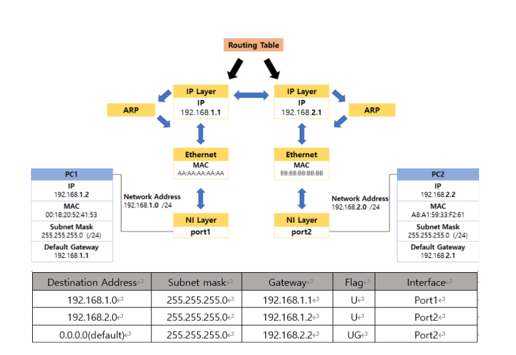

# Computer Network
- 이전 학기 [데이터 통신과목의 과제물](https://github.com/Limm-jk/2020_Spring_DataCommunication)을 바탕으로 이루어짐

**[ARP(Address Resolution Protocol)](https://github.com/Limm-jk/2020_Fall_Network_Project/blob/master/README.md#arpaddress-resolution-protocol)**   
**[Routing Table](https://github.com/Limm-jk/2020_Fall_Network_Project/blob/master/README.md#routing-table)**

## ARP(Address Resolution Protocol)
### 기능
IP와 MAC의 대응관계를 성립하는 역할을 담당하는 Protocol
  - ARP     
    - 일반적으로 응용 프로그램 등에 사용되는 주소는 IP주소(32bit)  
    - 실제 호스트 간 데이터 송신 시 이데넷 프레임의 목적지 인터페이스를 결정하는 것은 물리적 주소인 MAC주소(48bit)  
    - 그러므로 논리적 주소(IP)를 알고 있을 때, 대응되는 물리적 주소(MAC)를 알아오는 과정 필요  
    - 논리적인 IP주소와 물리적인 MAC주소의 대응을 위해 ARP를 사용   
  - Proxy ARP
    - 동일 네트워크에서 다른 HOST를 대신하여 ARP Request에 응답토록 하는 프로토콜
    - ProxyTable에 수신받은 네트워크 정보가 있으면, MAC주소를 알려줌
  - Gratuitous ARP
    - 네트워크 상에서 같은 IP를 사용하는 HOST가 있는 지 검사
    - 자신의 IP를 목적지로 설정하여 전송
    - 응답이 있으면 해당 IP를 사용하는 HOST가 있음을 알 수 있음  

### 개발 환경
원활한 ARP 테스트를 위하여 3개 이상의 가상 HOST필요. 
- Windows OS
- JAVA(-version 8) / Eclipse
- WinPcap
- WireShark
- JnetPcap
- WMware WorkStation player 15.5

### 실습 시나리오  
  
**Basic ARP**  
1.  1번 컴퓨터에서 3번 컴퓨터의 IP주소를 입력 후 Send.  
2.  ArpAppLayer에서 TCP, IP, ARP, Ethernet, NI를 거쳐 2, 3번 컴퓨터로 브로드캐스팅 전달  
3.  2, 3번 컴퓨터에서는 패킷을 받아 cache업데이트  
4.  3번 컴퓨터는 1번 컴퓨터로 ARP Reply  
5.  1번 컴퓨터의 ARP Cache Table 업데이트  


**Proxy ARP**  
1. 1번 컴퓨터에서 Proxy Add로 ip 11.11.11.11, mac 22:22:22:22:22:22 설정  
2. 3번 컴퓨터에서 11.11.11.11 주소로 ARP Request  
3. 1, 2번 컴퓨터는 3번의 ARP Cache Table 업데이트  
4. 1번 컴퓨터는 자신의 Proxy Entry를 확인하고 자신의 Mac주소를 씌워 ARP Reply  
5. 3번 컴퓨터는 1번 컴퓨터의 Mac 주소로 11.11.11.11과 매칭하여 캐시테이블 업데이트  


**GARP**  
1. 1번 컴퓨터는 3번 컴퓨터로 Basic ARP 전송  
2. 2, 3번은 Cache Table 업데이트  
3. 1번 컴퓨터는 01:02:03:04:05:06로 GARP를 보냄  
4. 2, 3번 컴퓨터는 1번의 MAC주소를 01:02:03:04:05:06 으로 변경

## Routing Table

Routing Table
```
Destination : Byte[4]
NetMask : Byte[6]
CountNetmask : Int
GateWay : Byte[4]
Flag : Boolean[3]
Interface : String
Metric : Int
```

### 개발 환경
원활한 ARP 테스트를 위하여 3개 이상의 가상 HOST필요. 
- Windows OS
- JAVA(-version 8) / Eclipse
- WinPcap
- WireShark
- JnetPcap
- WMware WorkStation player 15.5

### 실습 시나리오  
  
**PC1 ↔ PC2**

**Routing 프로그램 동작 전**

1. 라우터 PC역할을 하는 PC에서 각각 프로그램을 실행 

2. Host역할의 PC와 라우터 PC IPv4 속성 설정 

3. 속성 설정 시 기본 게이트웨이는 각각 연결된 장비의 IP로 설정  

4. Host PC에서만 기본 게이트웨이 설정 
  > 만약에, 과정이 진행이 안되면 Router에서도 기본 게이트웨이 설정

5. 두 대의 Host PC와 n개의 라우터 역할을 하는 PC는 네트워크로 연결 
  > 라우터 역할을 하는 PC는 두개의 LAN을 가지고 있으며 USB 이더넷을 활용

6. Host PC Cmd에서 netstat –rn 명령어를 사용해서 라우팅 경로 확인  라우터 PC로 나가는 경로 존재 확인 후 진행 

7. Routing Table 수동으로 입력 
  >Routing entry에 맞게 모든 항목을 채워서 작성 후 테이블에 등록   
 	**토폴로지에 맞게 routing entry 등록**  
  Default gateway 주소도 등록   

**Routing 프로그램 동작 시**   


1. ARP 기능으로 자신을 LAN 상 다른 호스트 또는 라우터에게 알림  
 
2. 한 호스트에서 ping 기능으로 다른 네트워크의 호스트와 통신 가능 여부를 확인 요청

    * PC에서 라우팅 경로를 확인 후 ping   
    * 보내기 전 ARP cache에 정보가 없으면 ARP Request를 보내고 라우터에서 응답을 받은 Mac주소로 ping 전달  
    * 이미 Host PC Cmd에서 arp –a 명령어를 사용했을 때 라우터 IP에 대한 Mac주소 가 entry에 존재하면 바로 ping 전달

3. PC1에서  PC2로 ping 보냄

4. PC1과 직접적으로 연결된 라우터는 ICMP 메시지를 수신
    *  ICMP의 목적 IP 주소를 이용    
    * Router의 Routing Table을 확인    
    * 수신된 ICMP의 목적 IP 주소와 매칭되는 네트워크 인터페이스로 수신된 ICMP를 그대로 전달  
    * 만약 Router가 자신의 서브넷에 포함된 호스트를 목적지로 한 ICMP 메시지를 수신한 경우에는 ARP cache table에서 해당 호스트에 대한 Ethernet address를 이용하여, ICMP 메시지를전달    

5. PC2에 도착한 ICMP는 reply 메시지로, PC1으로 전달됨 

6. 처음과 동일한 방식으로, 다시 PC1으로 ICMP 메시지가 전달 됨
