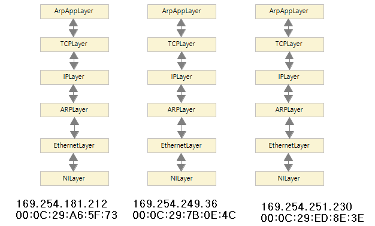

# Computer Network
- 이전 학기 [데이터 통신과목의 과제물](https://github.com/Limm-jk/2020_Spring_DataCommunication)을 바탕으로 이루어짐

**[ARP(Address Resolution Protocol)](https://github.com/Limm-jk/2020_Fall_Network_Project/blob/master/README.md#arpaddress-resolution-protocol)**   
**Routing Table**

## ARP(Address Resolution Protocol)
### 기능
IP와 MAC의 대응관계를 성립하는 역할을 담당하는 Protocol
  - ARP     
    - 일반적으로 응용 프로그램 등에 사용되는 주소는 IP주소(32bit)  
    - 실제 호스트 간 데이터 송신 시 이데넷 프레임의 목적지 인터페이스를 결정하는 것은 물리적 주소인 MAC주소(48bit)  
    - 그러므로 논리적 주소(IP)를 알고 있을 때, 대응되는 물리적 주소(MAC)를 알아오는 과정 필요  
    - 논리적인 IP주소와 물리적인 MAC주소의 대응을 위해 ARP를 사용   
  - Proxy ARP
    - 동일 네트워크에서 다른 HOST를 대신하여 ARP Request에 응답토록 하는 프로토콜
    - ProxyTable에 수신받은 네트워크 정보가 있으면, MAC주소를 알려줌
  - Gratuitous ARP
    - 네트워크 상에서 같은 IP를 사용하는 HOST가 있는 지 검사
    - 자신의 IP를 목적지로 설정하여 전송
    - 응답이 있으면 해당 IP를 사용하는 HOST가 있음을 알 수 있음  

### 개발 환경
원활한 ARP 테스트를 위하여 3개 이상의 가상 HOST필요. 
- Windows OS
- JAVA(-version 8) / Eclipse
- WinPcap
- WireShark
- JnetPcap
- WMware WorkStation player 15.5

### 실습 시나리오  
  
**Basic ARP**  
1.  1번 컴퓨터에서 3번 컴퓨터의 IP주소를 입력 후 Send.  
2.  ArpAppLayer에서 TCP, IP, ARP, Ethernet, NI를 거쳐 2, 3번 컴퓨터로 브로드캐스팅 전달  
3.  2, 3번 컴퓨터에서는 패킷을 받아 cache업데이트  
4.  3번 컴퓨터는 1번 컴퓨터로 ARP Reply  
5.  1번 컴퓨터의 ARP Cache Table 업데이트  

**Proxy ARP**  
1. 1번 컴퓨터에서 Proxy Add로 ip 11.11.11.11, mac 22:22:22:22:22:22 설정  
2. 3번 컴퓨터에서 11.11.11.11 주소로 ARP Request  
3. 1, 2번 컴퓨터는 3번의 ARP Cache Table 업데이트  
4. 1번 컴퓨터는 자신의 Proxy Entry를 확인하고 자신의 Mac주소를 씌워 ARP Reply  
5. 3번 컴퓨터는 1번 컴퓨터의 Mac 주소로 11.11.11.11과 매칭하여 캐시테이블 업데이트  

**GARP**  
1. 1번 컴퓨터는 3번 컴퓨터로 Basic ARP 전송  
2. 2, 3번은 Cache Table 업데이트  
3. 1번 컴퓨터는 01:02:03:04:05:06로 GARP를 보냄  
4. 2, 3번 컴퓨터는 1번의 MAC주소를 01:02:03:04:05:06 으로 변경
